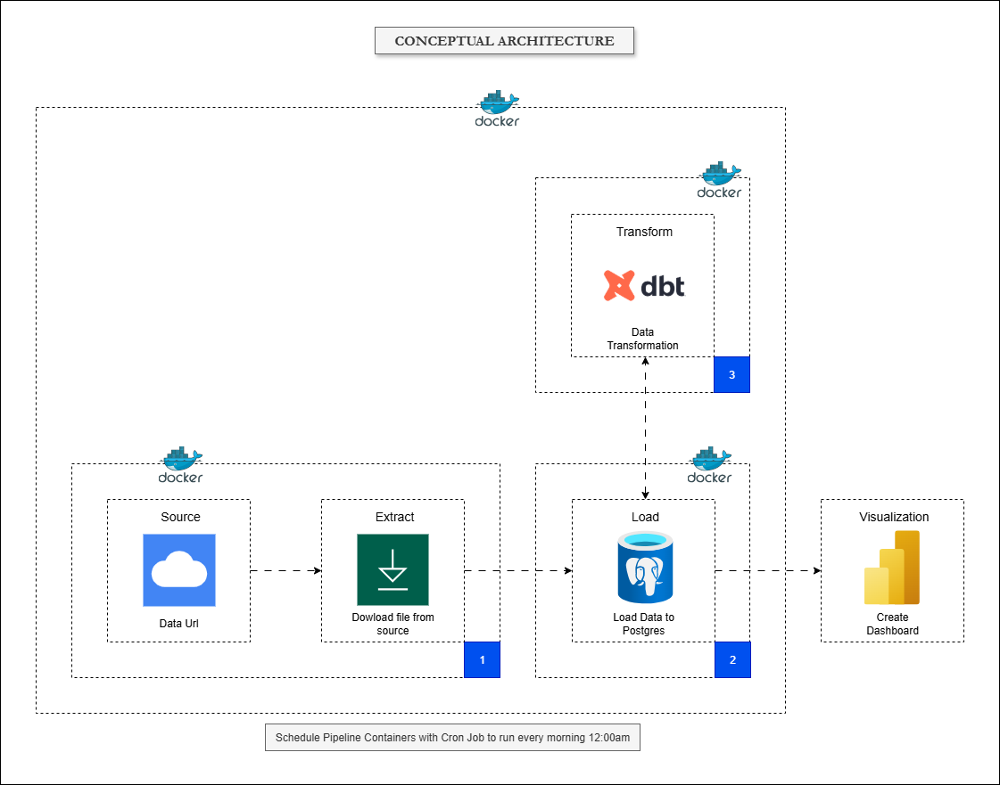

### README.md

\# End-to-End ETL Pipeline with Python, dbt, Docker, and Power BI

## Project Overview

This project demonstrates a robust, end-to-end data pipeline solution that downloads raw data from a source, loads it into a PostgreSQL database, transforms it using dbt, and visualizes the results in a Power BI dashboard. The entire workflow is containerized using Docker and automated with a cron job for daily execution.

### Key Features
-   **Data Ingestion:** A Python script extracts data from a web source and loads it into a PostgreSQL database.
-   **Data Transformation:** \`dbt\` is used to build a data warehouse, ensuring data quality and creating a clean data model.
-   **Containerization:** The entire pipeline (ETL, dbt, and PostgreSQL) is containerized using Docker for portability and consistency.
-   **Cross-Platform Automation:** A dynamic bash script orchestrates the pipeline on both WSL and Git Bash environments.
-   **Scheduling:** A host-level cron job is set up to run the pipeline daily at a scheduled time.
-   **Visualization:** The transformed data is connected to a Power BI dashboard for analysis and reporting.

## Project Architecture

A logical architecture was designed to visualize the flow of data through the pipeline.

## Getting Started

### Prerequisites

Before you begin, ensure you have the following software installed:
-   **Git**
-   **Docker Desktop** (for Windows)
-   **Windows Subsystem for Linux (WSL)**
-   **Power BI Desktop**
-   **Conda** (Miniconda or Anaconda) for managing the local Python environment.

### Project Setup

1.  **Clone the repository:**
    \`\`\`bash
    git clone \<your_remote_repository_url\>
    cd \<your-project-directory\>
    \`\`\`

2.  **Set up environment variables:**
    Create a \`.env\` file in the root of the project to store your database credentials.
    \`\`\`bash
    \# Example .env file content
    DB\_USER=your\_user
    DB\_PASSWORD=your\_password
    DB\_NAME=your\_db\_name
    DB\_PORT=5434
    DB\_SCHEMA=dev\_staging
    \`\`\`

3.  **Configure dbt profiles locally:**
    Copy your \`profiles.yml\` file into the \`dbt\_transformation\` directory.
    \`\`\`bash
    cp /mnt/c/Users/USER/.dbt/profiles.yml ./dbt_transformation/profiles.yml
    \`\`\`
    Make sure your local \`profiles.yml\` is configured to read from environment variables.
    \`\`\`yaml
    \# dbt\_transformation/profiles.yml
    dbt\_transformation:
      target: dev
      outputs:
        dev:
          type: postgres
          threads: 1
          host: "{{ env_var('DB_HOST') }}"
          user: "{{ env_var('DB_USER') }}"
          pass: "{{ env_var('DB_PASSWORD') }}"
          port: "{{ env_var('DB_PORT') | int }}"
          dbname: "{{ env_var('DB_NAME') }}"
          schema: "{{ env_var('DB_SCHEMA') }}"
    \`\`\`

## Local Pipeline Development

### Python ETL Scripting

The project began with a Python script for the ETL process.

**Commands:**
\`\`\`bash
\# Activate conda environment
conda activate venv310

\# Run the ETL script
python etl_pipeline.py
\`\`\`

### dbt Transformation

After the data was loaded, dbt was used for transformation.

**Commands:**
\`\`\`bash
\# Navigate to the dbt project folder
cd dbt\_transformation

\# Debug the dbt connection
dbt debug

\# Run and test the models
dbt build
\`\`\`

## Automating the Pipeline Locally

A bash script was created to automate the ETL and dbt process. It dynamically handles execution based on the environment (WSL or Git Bash) and logs all output to a file.

### Scheduling with Cron

The bash script was scheduled to run daily at 12:00 AM using \`cron\` in WSL.

**Commands:**
\`\`\`bash
\# Open the crontab for editing
crontab -e

\# Add the schedule entry
0 0 \* \* \* /path/to/your/project/run\_etl\_pipeline.sh \>\> /tmp/cron\_etl.log 2\>\&1

\# Check the cron service status
sudo service cron status
\`\`\`

## Dockerizing for Collaboration

To containerize the pipeline, separate Dockerfiles were created for the Python ETL and dbt steps, and they were orchestrated using Docker Compose.

### Dockerfiles

**\`Dockerfile\` (for Python ETL):**
\`\`\`dockerfile
FROM python:3.10-bookworm

WORKDIR /app

COPY requirements.txt .
RUN pip install --no-cache-dir -r requirements.txt

COPY . .

CMD ["/app/run_etl_pipeline.sh"]
\`\`\`

**\`dbt_transformation/Dockerfile\` (for dbt):**
\`\`\`dockerfile
FROM python:3.11-slim

WORKDIR /app/dbt_transformation

COPY requirements.txt .
RUN pip install --no-cache-dir dbt-postgres

CMD ["dbt", "build"]
\`\`\`

### Orchestration with Docker Compose

The \`docker-compose.yml\` file orchestrates the services.

### Pushing to Docker Hub

To enable collaboration, the custom images were pushed to Docker Hub.

**Commands:**
\`\`\`bash
\# Log in to Docker Hub
docker login

\# Build and push the images
docker compose build
docker compose push
\`\`\`

## Automating the Dockerized Pipeline

A final bash script was created to automate the Docker Compose workflow for scheduling.

### The Final Cron Job

The final cron job runs the Docker automation script.

**Commands:**
\`\`\`bash
\# Edit the crontab
crontab -e

\# Add the new schedule entry
0 0 \* \* \* /path/to/your/project/cron\_daily\_run\_for\_docker.sh \>\> /tmp/docker\_pipeline.log 2\>\&1
\`\`\`

## Visualization with Power BI

### Connecting to the Database

Follow these steps to connect Power BI to your PostgreSQL database running in the Docker container:

1.  Open Power BI Desktop.
2.  Go to \`Get data -\> PostgreSQL database\`.
3.  Enter the connection details:
    -   **Server:** \`localhost\`
    -   **Database:** \`\<your_db_name\>\`
    -   **Port:** \`5434\`
4.  Authenticate using your \`DB\_USER\` and \`DB\_PASSWORD\`.

## Repository Structure

\`\`\`
.
├── .env
├── .gitignore
├── README.md
├── docker-compose.yml
├── run_etl_pipeline.sh
├── cron_daily_run_for_docker.sh
├── requirements.txt
├── etl_pipeline.py
├── dbt_transformation/
│   ├── dbt_project.yml
│   ├── profiles.yml
│   ├── models/
│   ├── Dockerfile
│   └── requirements.txt
├── Dockerfile
└── ...
\`\`\`

## Conclusion

This project provides a comprehensive blueprint for building a robust and automated data pipeline. The use of Docker ensures portability, while dbt enforces data quality, making the process reliable and scalable.
